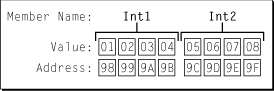
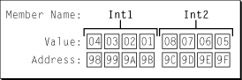

# C++ 学习笔记 


## 一、C++编译环境搭建

### a. gcc, g++, CC, cc 的区别

* gcc GNU 中的 c编译器， 后来扩展后包含很多编译器（C、C++、Objective-C、Ada、Fortran、 Java）
* g++编译c++ GNU 中的c++编译器
* cc 针对不同系统对应不同c编译器，在Unix中是c编译器，在linux系统中是一个符号链接，指向gcc
* CC 一般是makefile里面的一个名字，即宏定义.

***误区一：gcc只能编译C代码，g++只能编译C++代码***

两者都可以，但请注意：

（1）后缀为.c的，gcc把它当作是C程序，而g++当作是c++程序；后缀为.cpp的，两者都会认为是C++程序，注意，虽然C++是C的超集，但是两者对语法的要求是有区别的。C++的语法规则更加严谨一些。

（2）编译阶段，g++会调用gcc，对于C++代码，两者是等价的，但是因为gcc命令不能自动和C++程序使用的库联接，所以通常用g++来完成链接，为了统一起见，干脆编译/链接统统用g++了，这就给人一种错觉，好像cpp程序只能用g++似的。

***误区二：gcc不会定义__cplusplus宏，而g++会***

实际上，这个宏只是标志着编译器将会把代码按C还是C++语法来解释，如上所述，如果后缀为.c，并且采用gcc编译器，则该宏就是未定义的，否则，就是已定义。
 
***误区三：编译只能用gcc，链接只能用g++***

严格来说，这句话不算错误，但是它混淆了概念，应该这样说：编译可以用gcc/g++，而链接可以用g++或者gcc -lstdc++。因为gcc命令不能自动和C++程序使用的库联接，所以通常使用g++来完成联接。但在编译阶段，g++会自动调用gcc，二者等价。

>注：符号链接是一种特殊类型的文件，它的内容只是一个字符串。它可能指向一个存在的文件也可能什么都不指向。当您在命令行或程序里提到符号链接的时候，您实际上进入了它指向的文件，前提是这个文件是存在的。

### b. GNU make

**1.gnu make简介**

> make 在执行时,需要一个命名为 Makefile 的文件。这个文件告诉 make 以何种方 式编译源代码和链接程序。典型地,可执行文件可由一些.o 文件按照一定的顺序生成 或者更新。如果在你的工程中已经存在一个活着多个正确的 Makefile。当对工程中的若 干源文件修改以后,需要根据修改来更新可执行文件或者库文件,正如前面提到的你只 需要在 shell 下执行“make”。make 会自动根据修改情况完成源文件的对应.o 文件的 更新、库文件的更新、最终的可执行程序的更新。
make 通过比较对应文件(规则的目标和依赖,)的最后修改时间,来决定哪些文 件需要更新、那些文件不需要更新。对需要更新的文件 make 就执行数据库中所记录的 相应命令(在 make 读取 Makefile 以后会建立一个编译过程的描述数据库。此数据库 中记录了所有各个文件之间的相互关系,以及它们的关系描述)来重建它,对于不需要 重建的文件 make 什么也不做。

**2. makefile 规则**

```
target...: prerequisites...
	[tab]command
```

* target: 规则的目标， 通常是最后需要生成的文件名或者是生成的中间文件，比如.o文件，最后生成的可执行文件。也可以是make执行的动作名， 比如clean。
* prerequisites:规则的依赖。生成目标所需依赖的的文件名列表
* command:规则的命令行。是规则所要执行的动作(任意的 shell 命令或者是可在 shell 下执行的程序)。它限定了 make 执行这条规则时所需要的动作。

> 一个规则可以有多个命令行,每一条命令占一行。注意:每一个命令行必须以[Tab] 字符开始,[Tab]字符告诉 make 此行是一个命令行。make 按照命令完成相应的动作。 这也是书写 Makefile 中容易产生,而且比较隐蔽的错误。

举个栗子：

```

objects = firstApp.o header.o

firstApp : $(objects)
	g++ -o firstApp $(objects)
header.o : header.cpp header.h
	g++ -c header.cpp header.h	
firstApp.o : firstApp.cpp firstApp.h
	g++ -c firstApp.cpp firstApp.h

#.PHONY : clean
clean : 
	rm firstApp $(objects)


```
> 为了避免在依赖项和命令行中重复添加依赖文件， 实际工作中大家都比较认同的方法是,使用一个变量 “objects”、“OBJECTS”、“objs”、“OBJS”、“obj”或者“OBJ”来作为所有的.o 文 件的列表的替代。

在命令行执行```make firstApp``` 即可完成对firstApp.cpp, firstApp.h, header.cpp, header.h文件对编译链接， 在当前目录下生成名为firstApp的可执行文件。

执行```make ckean```即可删除编译生成的.o文件。

有关GNU make相关， 了解更多 <http://www.ruanyifeng.com/blog/2015/02/make.html>或者查看《GNU make 中文手册》

## 二、g++ 编译和链接

本次学习中主要使用g++编译cpp文件， 如果要用gcc， 把g++改成gcc即可。

* ```g++ -c main.cpp``` 编译.cpp文件，编译成果后生成main.o
* ```g++ -o <out name>  <.cpp file> ```， <out name> 为最终生成可执行文件的名字， .cpp文件为上一步编译的文件。比如： ```g++ -o main main.cpp``` 执行完毕后输入```./main```即可执行程序。

## 三、const 关键字

**修饰成员变量：**

区分常量、指针常量、常量指针：

```
const charStr[100]; //常量
char a = "a";
const char *p1 = &charStr; //常量指针

char *const p2 = &charStr; //指针常量
const int a = 0; //常量

p1 = &a; //yes
*p1 = a; //erro  常量指针内容不可以重新赋值

p2 = &a //erro  指针常量， 地址不能改变
*p2 = a //yes
```

* 常量指针p1：指向的地址可以变，但内容不可以重新赋值，内容的改变只能通过修改地址指向后变换。
* 指针常量p2：指向的地址不可以重新赋值，但内容可以改变，必须初始化，地址跟随一生。

> (*)（指针）和 const（常量） 谁在前先读谁 ; * 象征着地址，const象征着内容；谁在前面谁就不允许改变。

**修饰成员函数：**

## 四、结构体

结构体的定义如下：

```
struct 结构体名 
{

 结构体内容列表

};

```

举个栗子：

```
#pragma pack (2)

struct st 
{
int a: 3;
int sex: 1;
int n: 4;
int : 3;
int level : 3;
};

#pragma pack()

```

**a.位域**

> 有些信息在存储时，并不需要占用一个完整的字节， 而只需占几个或一个二进制位。例如在存放一个开关量时，只有0和1 两种状态， 用一位二进位即可。为了节省存储空间，并使处理简便，C语言又提供了一种数据结构，称为“位域”或“位段”。所谓“位域”是把一个字节中的二进位划分为几个不同的区域， 并说明每个区域的位数。每个域有一个域名，允许在程序中按域名进行操作。 这样就可以把几个不同的对象用一个字节的二进制位域来表示。

***位域的定义和位域变量的说明位域定义与结构定义相仿***

```
struct 位域结构名 
{

 位域列表

};

```
***其中位域列表的形式为：***

```类型说明符 位域名：位域长度```

>Tip: 空结构体所占大小为char 的大小， 占一个字节。

了解位域更详细的信息可以查看这篇博客：<http://www.cnblogs.com/bigrabbit/archive/2012/09/20/2695543.html>

**b.字节对齐**

* 1) 数据类型自身的对齐值：char型数据自身对齐值为1字节，short型数据为2字节，int/float型为4字节，double型为8字节。
* 2) 结构体或类的自身对齐值：其成员中自身对齐值最大的那个值。
* 3) 指定对齐值：#pragma pack (value)时的指定对齐值value。
* 4) 数据成员、结构体和类的有效对齐值：自身对齐值和指定对齐值中较小者，即有效对齐值=min{自身对齐值，当前指定的pack值}。

想深入了解子节对齐戳这里--><http://www.cnblogs.com/clover-toeic/p/3853132.html>

**c.union（联合体）**

```
struct STWithUnion
{
    union{
        unsigned char hex;
        struct{
            unsigned char low  : 4;
            unsigned char high : 4;
        };
    }convert;
    STWithUnion();
};

```

使用union关键字定义的字段公用存储空间。例如：

```
convert.low = 0x01;
convert.high = 0x02;
cout << "hex: " << convert.hex << " " << convert.low << " " << convert.high << " God "<< endl; 
cout << "union size: " << sizeof(convert) << endl;  

```
从结果可以看到hex的存储的内容为0x21或者0x12（根据操作系统是大端还是小端而定）， 具体输出结果需要看对应的ASCII码对应哪个字符。

**d.大端&小端**

```
struct {
    UInt32 int1;
    UInt32  int2;
} aStruct;

ExampleStruct   aStruct;
aStruct.int1 = 0x01020304;
aStruct.int2 = 0x05060708;

```
大端系统存储内容如下图：



小端系统存储内容如下图：



由上图可见， 大端系统字节内写入数据的顺序与地址顺序相同， 小端则反之。

> Tip: 需要注意的是， 这里说的顺序指的是字节内的顺序。

进一步了解大端小端请戳链接-->
<https://developer.apple.com/library/mac/documentation/CoreFoundation/Conceptual/CFMemoryMgmt/Concepts/ByteOrdering.html>

<http://www.linuxjournal.com/article/6788>

<http://c.biancheng.net/cpp/html/449.html>

## 参考文件
［1］cc、gcc、g++、CC的区别概括.<http://blog.csdn.net/abc78400123/article/details/6827751>


